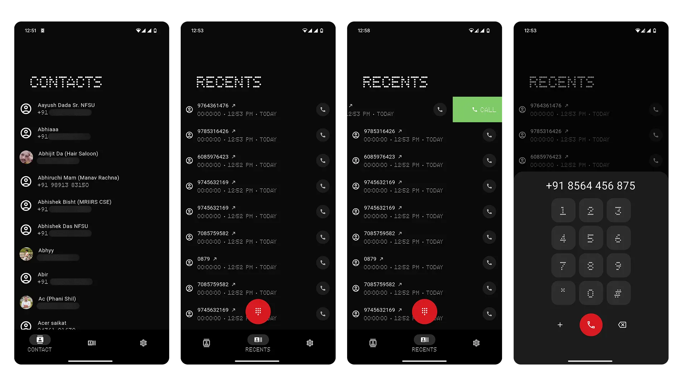

# Bloctry

Just randomly generated something to showcase. Android has some policies that doesn't allow unless explicitly said to. So if you want to try it, trust me bro. 🙂

## Screenshots

> Inspired from Nothing

> Featuring SliverAppbar (which minimizes on scroll)

## Security Concerns
There are the new policies that makes it harder to install and use. Anyways if you want to try the app you need to make sure to allow app permission. The only permission that it requires (which is sensative according to android) is making a phone call and accessing call logs. You might get this screen below.

> This app doesn't need internet so none of your data are gonna get stored somewhere. (Not a backend developer)